# Missile Mayhem

The datapack used for the missilemayhem minecraft minigame. Note this is a [PRIMD Minigame module](https://github.com/primd-os/Hub) and does not work on it's own.

Public server: `play.primd.net` Cerrently OFFLINE

Discord Server: <https://discord.gg/S6TUQWt>

## Download

1. Go to <https://github.com/Devon7925/MissileMayhem/releases> and download the latest release (the one you are viewing is a beta working on fixing bugs in the last (Mainline) master bulid as of 10/1/2021.)
2. Move the map in the zip folder to your .minecraft/saves folder

## Features

### Missiles

* Added the ability to have per player custom (this master build is broken when it comes to costums) missiles up to 3x3x17 in size
* Added indicator of the next three upcoming missiles
* Added system to prevent getting the same item in a row
* Added progress bar to show when players will get the next missile
* Players are given two items at the start of the game to get the game started faster
* Multiple per player Missile sets to allow playing with different play styles
  * New
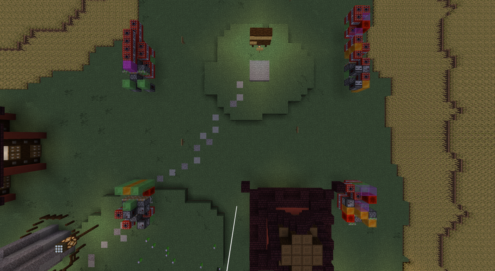
  * Original

  * Thin

  * Flat

* Allow placing missiles in any orientation in two different modes you can swap between by dropping items
  * Directional, in which the missile spawns in the direction you look
  * Fixed, which spawns in the direction you were looking when you switched to fixed
  * Shields are also affected by direction
  * Actionbar tells you what mode you're in

### Items

* Gunblade has knockback
* You can shoot fireballs using the gunblade by using your offhand, this makes them more usable, especially while riding missiles
* Removed limits on the amount of arrows you can have in your inventory but give 2 arrows instead of three
* Fireballs do knockback so you can fireball jump

### Maps

* Added options to choose different maps
* These are Normal, No Walls, Small Walls, Center Wall, Platforms, Weak Center, Bridge, Diagonal, and Towers
* These maps work in all modes and are voted on by the players in the queue

#### Normal

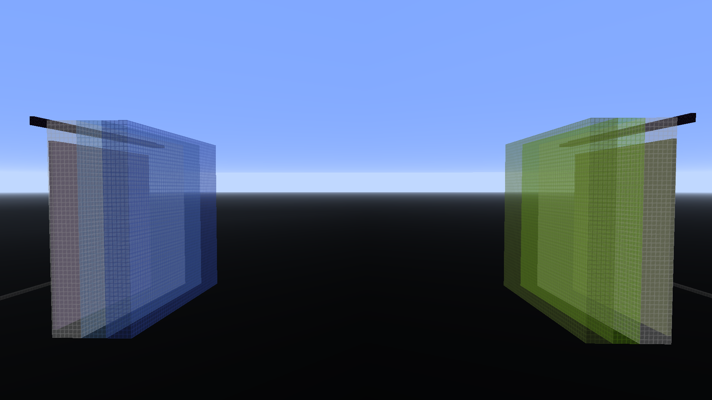

#### Small Walls

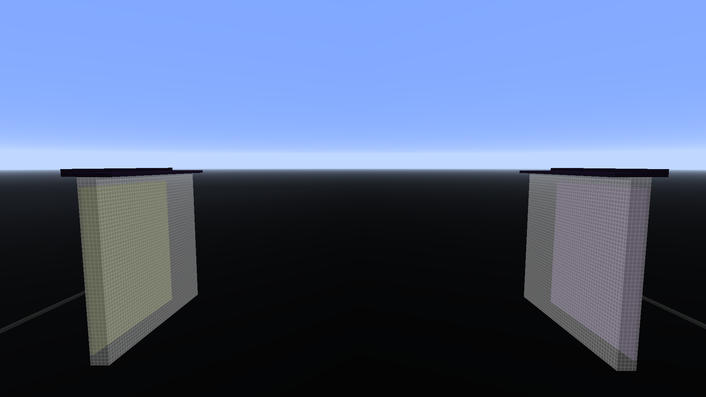

#### Center Wall

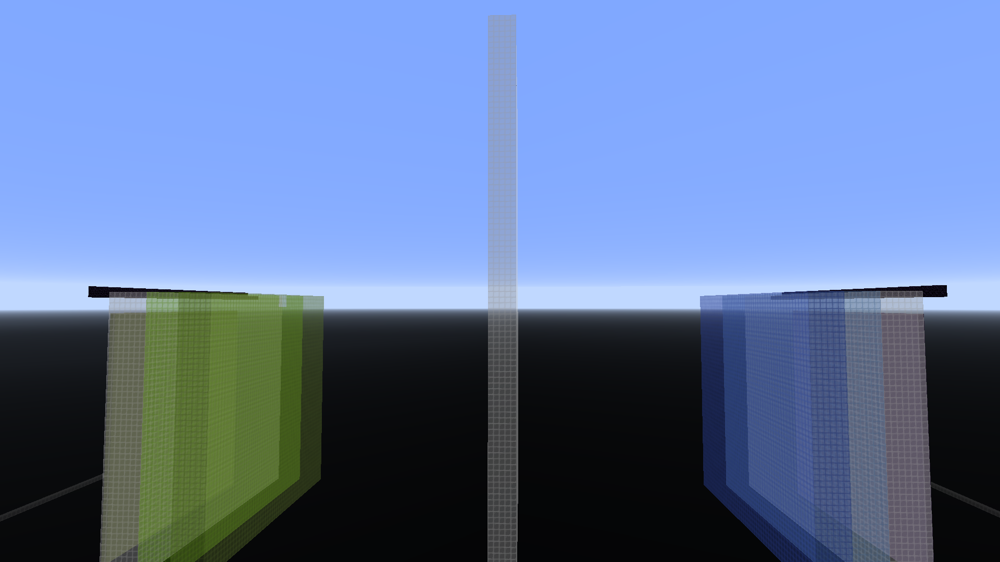

#### Platforms

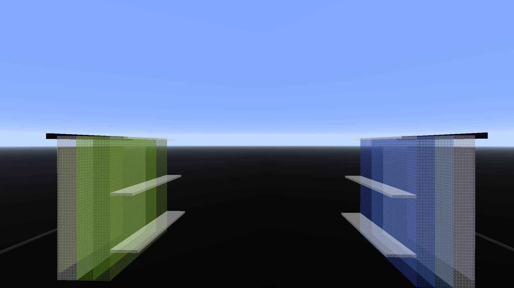

#### Weak Center

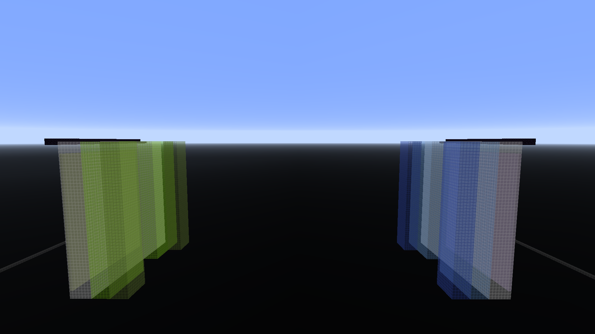

#### Diagonal

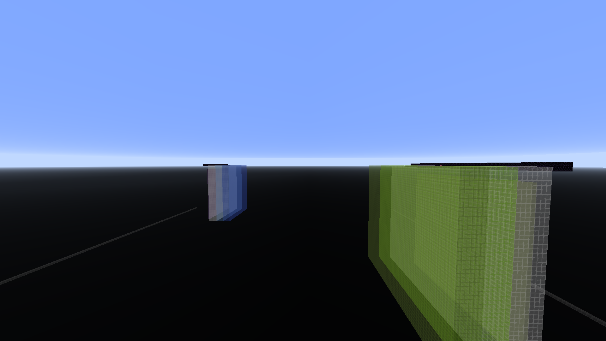

### Towers

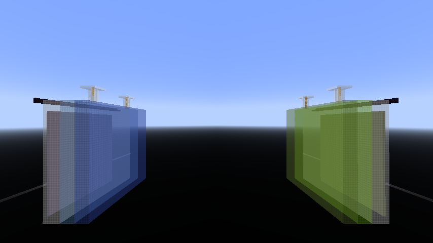

### Game Modes

* Current modes are Normal, King of the Hill, and Capture the Flag
* Normal
  * In normal mode you destroy the blocks behind every other team's base to win
  * You can tie in 2 teams mode if both teams destroy the opponents portal within a small amount of time
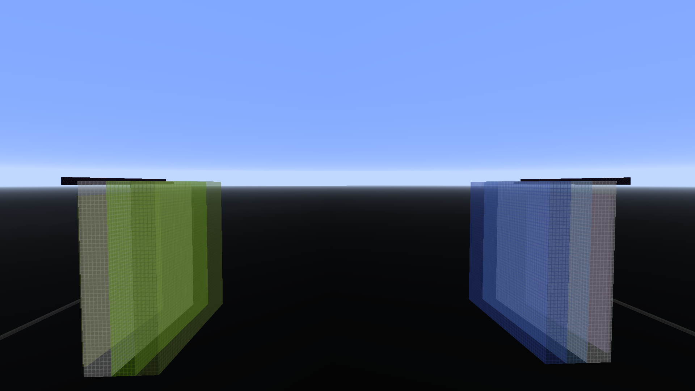
* KOTH Mode
  * In KOTH mode your team must stay above the center platform for a set amount of time to win

* CTF Mode
  * In CTF mode your team must capture all the flags behind opponent's bases to win
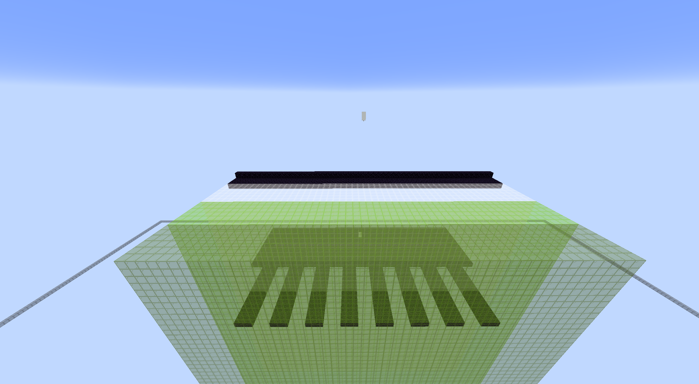

### Team Amounts

* There are 2 Team and 4 Team modes for every game mode with that amount of teams
  * 2 Teams
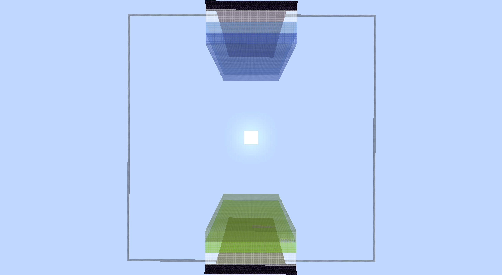
  * 4 Teams
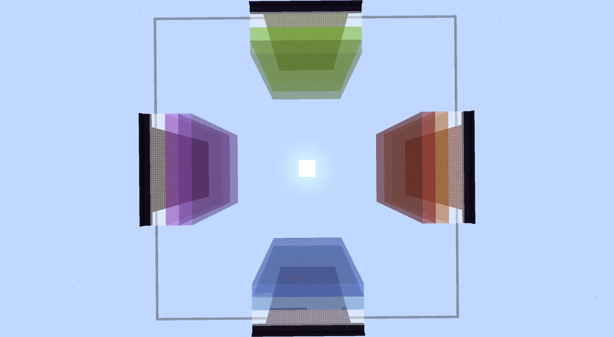

### General

* Expanded size of starting obsidian platform to decrease chance of accidentally falling off when wall is destroyed
* Automatically kill players below y=-64 to reduce fall time
* Give haste to players to reduce time to break blocks
* TNT is collectable and placable
* Added an interesting queue
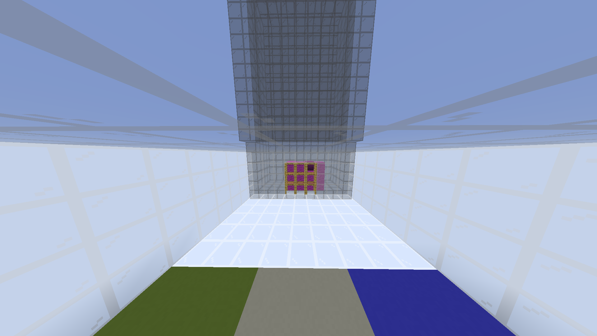
* Used blocks instead of a portal so they can be colored to match the team's color
* There is an optional skill tracking system whose top players are shown in the lobby
* Added Practice mode that gives infinite missiles and defence items for practicing
* Added Advancements
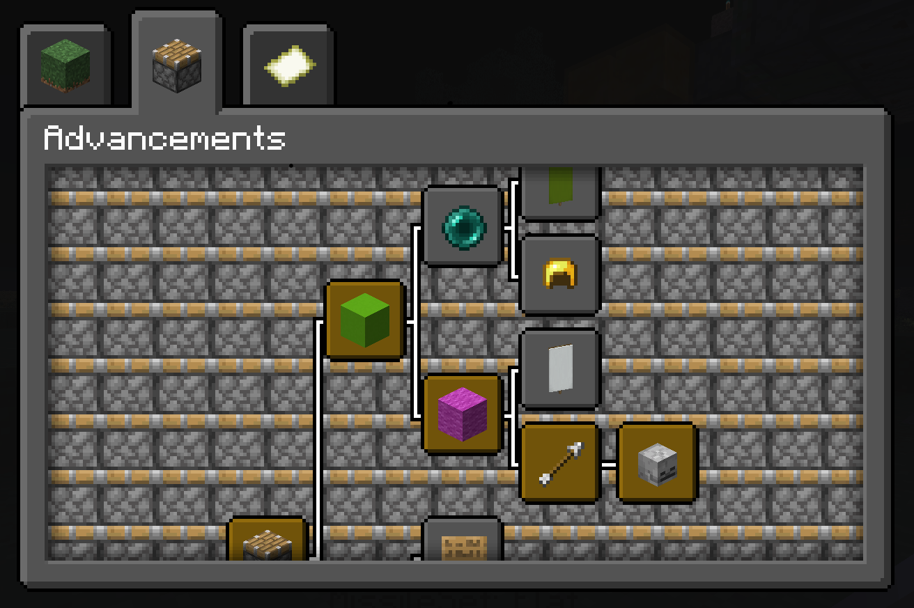

### Technical Changes

* Remade the original code using datapacks and 1.16 command syntax
* Used triggers to allow easy player control via commands
* Used custom dimensions to allow multiple games to occur at the same time

## Credits

* Devon7925 - Development
* Sac1 - Lobby Build
* Moses25 - Flat Missile Set
