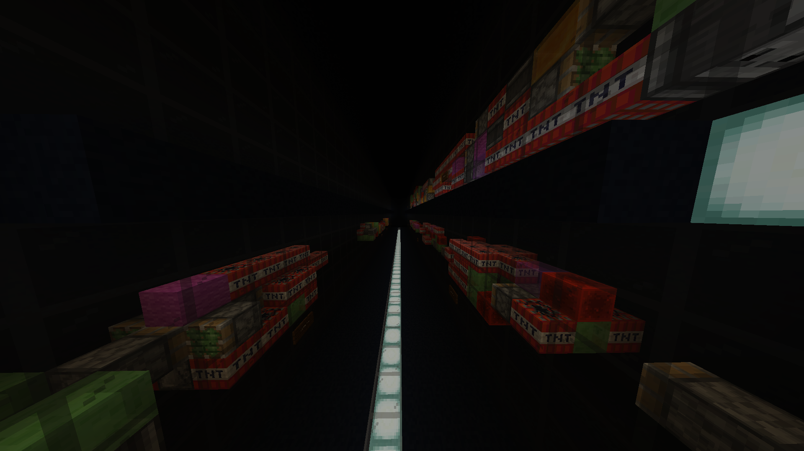
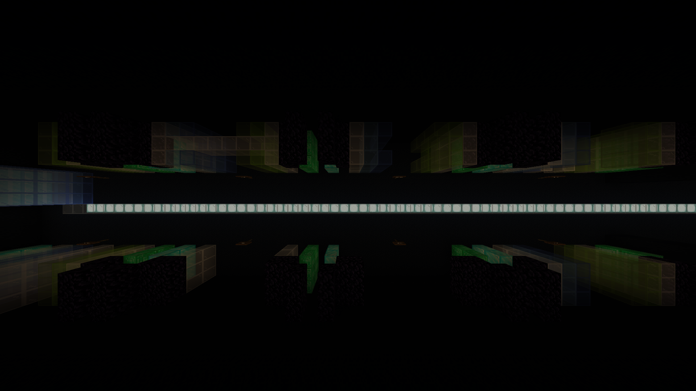
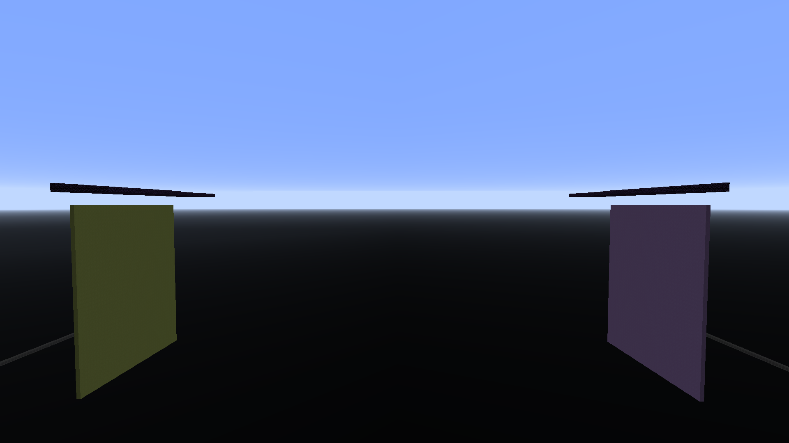
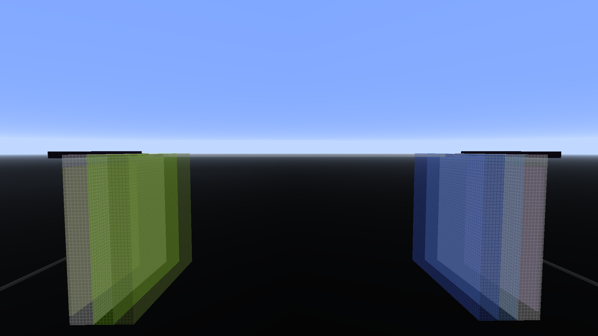

# MissileMars
The datapack used for the missilemars minecraft map and server.

~~Server ip: missilemars.my.pebble.host~~ Server shut down due to costs
Testing sessions will be announced on discord

Discord Server: https://discord.gg/S6TUQWt

# Download
1. Go to https://github.com/Devon7925/MissileMars/releases and download the latest release
2. Move the map in the zip folder to your .minecraft/saves folder

# Build Latest version
Note the latest version will likely have more bugs than release versions.

To build, download this project and put it in the datapacks folder and enable it when creating a world.

# Improvements
## Missiles

* Added the ability to have per player custom missiles up to 3x3x17 in size
* Added actionbar to indicate upcoming missiles
* Added system to prevent giving the same item in a row
* Added progress bar to show when players will get the next missile
* Players are given two items at the start of the game to get the game started faster
* Multiple per player Missile sets to allow playing with different play styles
    * Currently supported are new, original, and thin. Each has its own play style. 
* Allow placing missiles in any orientation in two different modes you can swap between by dropping items
    * Directional, in which the missile spawns in the direction you look
    * Fixed, which spawns in the direction you were looking when you switched to fixed
    * Subtitle tells you what mode you're in

## Items
* Gunblade has knockback
* You can shoot fireballs using the gunblade by using your offhand, this makes them more usable, especially while riding missiles
* Removed limits on the amount of arrows you can have in your inventory but give 2 arrows instead of three
* Fireballs do knockback so you can fireball jump

## Maps

* Added options to choose different maps
* These are Normal, No Walls, Small Walls, Center Wall, Platforms, Weak Center, Bridge, and Diagonal
* These maps work in all modes and are voted on by the players in the queue
### Normal

### No Walls

### Small Walls

### Center Wall

### Platforms

### Weak Center

### Bridge

### Diagonal

## Game Modes
* Added game modes
* Current modes are Normal, King of the Hill, and Capture the Flag
* Normal
    * In normal mode you destroy the blocks behind every other teams base to win
    * You can tie in 2 teams mode if both teams destroy the opponents portal within a small amount of time

* KOTH Mode
    * In KOTH mode your team must stay above the platform in the center for a minute to win

* CTF Mode
    * In CTF mode your team must capture all the flags behind peoples bases to win

## Team Amounts
* There are 2 Team and 4 Team modes for every game mode with that amount of teams

## General
* Expanded size of starting obsidian platform to decrease falling off when wall is destroyed
* Automatically kill players below y=-64 to reduce fall time and improve experience
* Give haste to players to reduce time to break blocks
* TNT is collectable and placable
* Added an interesting queue

* Used blocks instead of a portal so they can be colored to match the team's color
* There is an optional skill tracking system whose top players are shown in the lobby
* Added Practice mode that gves infinite missiles

## Technical Changes
* Remade the original code using datapacks and 1.13 command syntax
* Used triggers to allow extensive player control
* Used custom dimensions to allow multiple games to occur at the same time
